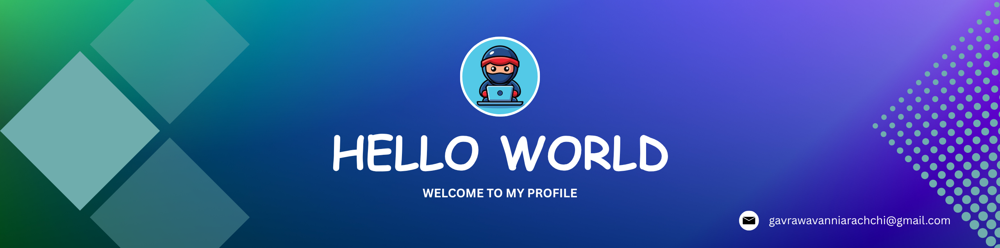

 <!--Banner-->
 
 

 <!--img animation-->
 

  

 <!--Header Text-->
 

  

 <h3 align="center">

 </h3>
 

<!--Owl image-->

#
 <!--Description-->

I am currently following the Software Engineering degree.I learn the fundamentals and advanced concepts of programming, data structures, algorithms, database management systems, and software engineering. I am passionate about problem-solving and developing new software that will add value to the community and make human life easier in any way possible.I am always eager to learn modern technologies and implement them in current solutions to make them more efficient and robust. Currently, I am learning backend development using Java, Node js , MySQL, MongoDb as well as web frontend development using HTML, CSS, JavaScript, and React 

#

  

- 🌱 I’m currently learning **JavaScript | Java | C++ | MERN Stack | Spring boot **

- 👨‍💻 All of my projects are available at https://github.com/gthilakshana

- 📫 How to reach me **gavrawavanniarachchi@gmail.com**

 

<h2 align="center">🌟 Tᴇᴄʜ sᴛᴀᴄᴋ 🌟</h2>  

<!-- Badges from https://github.com/Ileriayo/markdown-badges -->

<!--Contact Section--> 
 
<h2 align="center">🤝 Cᴏɴɴᴇᴄᴛ Wɪᴛʜ Mᴇ 🤝 </h2>

  

&nbsp;&nbsp;

&nbsp;&nbsp;

&nbsp;&nbsp;

  
    <h4 align="center">
       
    </h4>

 

  

<!--
**gthilakshana/gthilakshana** is a ✨ _special_ ✨ repository because its `README.md` (this file) appears on your GitHub profile.

Here are some ideas to get you started:

- 🔭 I’m currently working on ...
- 🌱 I’m currently learning ...
- 👯 I’m looking to collaborate on ...
- 🤔 I’m looking for help with ...
- 💬 Ask me about ...
- 📫 How to reach me: ...
- 😄 Pronouns: ...
- ⚡ Fun fact: ...
-->
